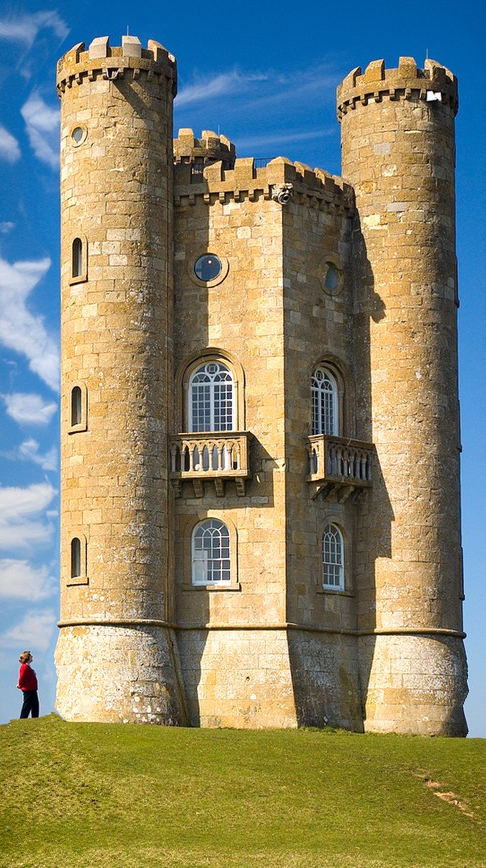
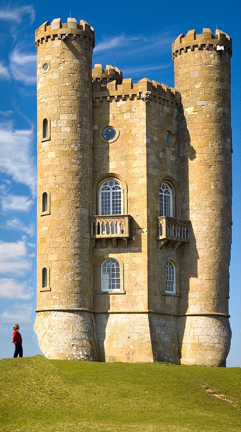
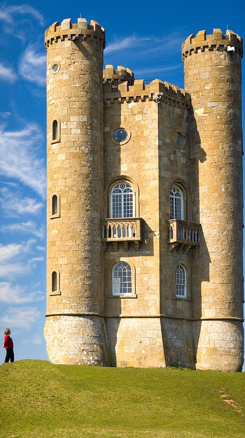

# Seam carving

Content-aware image scaling as described by [[1]](https://doi.org/10.1145%2F1275808.1276390).

Usage example: `python carve.py broadway_tower.jpg output/broadway_tower --iteration_count=300`  
To see the carving animated, use the `make_gif.py` script.

Comparison of three different energy functions after 793 iterations:

Granular saliency  
  
Spectral residual saliency + gradient magnitude  
  
Gradient magnitude  
  

Supported energy functions:

* gradient magnitude
* spectral residual saliency
* fine grained saliency
* spectral saliency + gradient magnitude
* entropy (3-channel or grayscale)

Entropy tends to be the slowest, spectral saliency is the fastest. Gradient usually perform the best.
Due to the overhead in conversion, 3-channel entropy is faster than grayscale.

\[1] Avidan, Shai; Shamir, Ariel (July 2007). "Seam carving for content-aware image resizing | ACM SIGGRAPH 2007 papers". Siggraph 2007: 10. doi:10.1145/1275808.1276390
