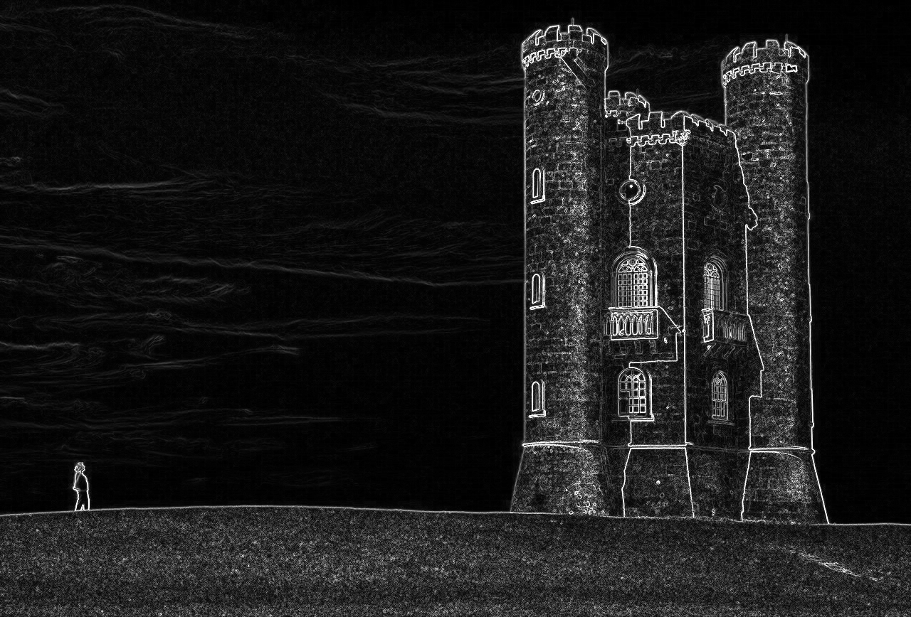
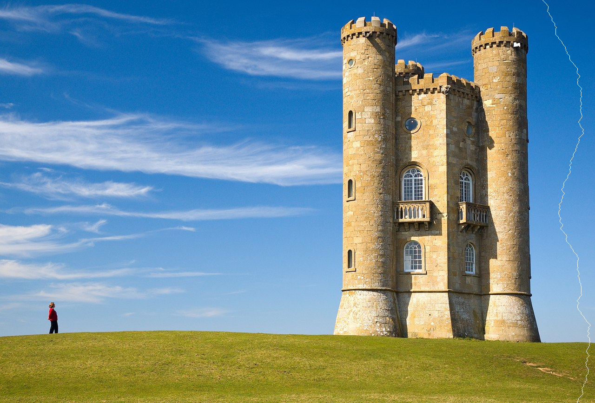
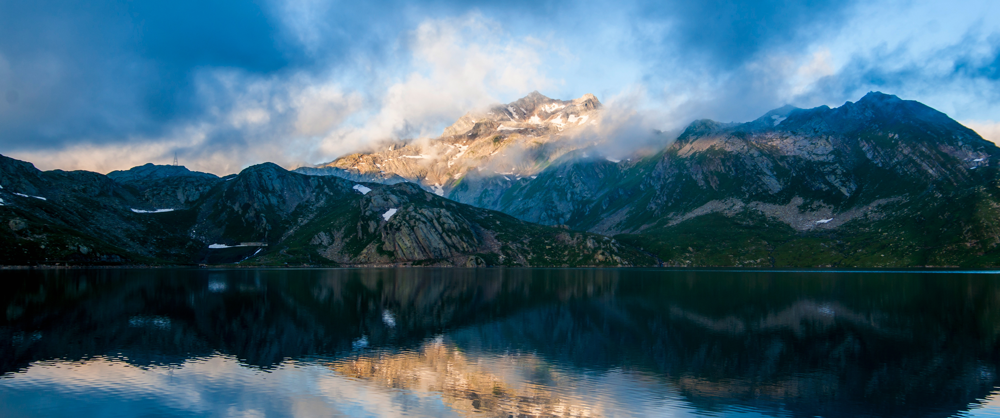

# Seam carving

Content-aware image scaling as described by [[1]](https://doi.org/10.1145%2F1275808.1276390).

Usage example: `python carve.py broadway_tower.jpg output/broadway_tower --iteration_count=300`  

To see the carving animated, use the `make_gif.py` script.  
Usage example: `python make_gif.py output/broadway_tower`

Original image:  

Energy function (e.g. gradient magnitude):  

Lowest energy seam (e.g. using Dijkstra's algo):  

Shrunk image (297 iterations):  

## More examples

width=3440px  

width=2440px  

width=3440px  

width=2440px  

width=1440px  

Supported energy functions:

* gradient magnitude
* spectral residual saliency
* fine grained saliency
* spectral saliency + gradient magnitude
* entropy (3-channel or grayscale)

Entropy tends to be the slowest, spectral saliency is the fastest. Gradient usually perform the best.
Due to the overhead in conversion, 3-channel entropy is faster than grayscale.

\[1] Avidan, Shai; Shamir, Ariel (July 2007). "Seam carving for content-aware image resizing | ACM SIGGRAPH 2007 papers". Siggraph 2007: 10. doi:10.1145/1275808.1276390
